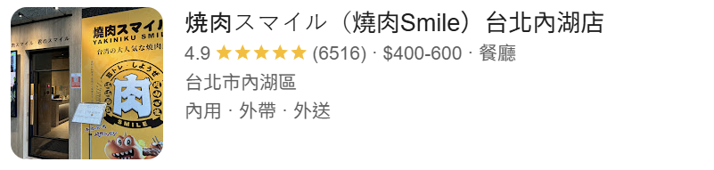
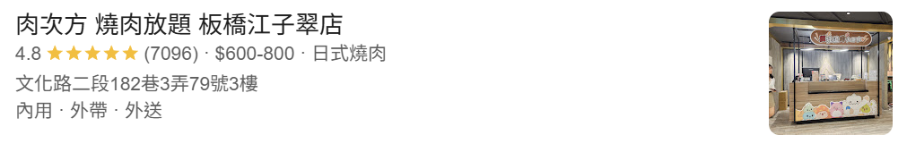

# Cloud_Final｜雲端 AI 工具箱

本專案使用 **Python Flask** 整合 Azure 雲端服務，提供圖片描述翻譯與語音朗讀、PDF 文字擷取、OCR 地址定位，以及智慧菜單翻譯與過敏原關鍵字提醒。

使用者可以在同一個網站選擇工具、輸入圖片網址或上傳檔案，查看辨識文字、繁體中文翻譯、語音播放與地圖定位結果。介面採用橘紅色漸層、發光卡片與粒子動畫，呈現一致的工具箱風格。

---

## 📚 目錄

- [專案功能介紹](#專案功能介紹)
- [使用技術](#使用技術)
- [本機執行](#本機執行)
- [部署說明](#部署說明)
- [程式碼說明](#程式碼說明)
- [成果展示](#成果展示)
- [Contributors](#contributors)
- [License](#license)

---

## 專案功能介紹

### 📷 圖片翻譯與語音

輸入可公開存取的圖片 URL，使用 Azure Computer Vision 產生圖片描述，接著翻譯為繁體中文並合成語音。

- 顯示原始圖片、英文描述與辨識信心分數。
- 使用 Azure Translator 產生繁體中文翻譯。
- 使用 Azure Speech 合成中文語音，於網頁播放器播放。

### 📄 PDF 摘要工具

上傳 PDF 檔案，使用 Azure Document Intelligence 的 `prebuilt-read` 模型擷取各頁文字，將內容串接後顯示前 **1,000 個字元**。

目前介面名稱為「PDF 摘要工具」，實際處理方式是文字擷取與截取預覽；超過 1,000 個字元時會在結尾加上 `...`。

### 🗺️ OCR 地圖定位

上傳含有店家名稱或地址的圖片，透過 Computer Vision OCR 擷取文字，再由 Azure Maps 查詢座標。

- 顯示圖片中的文字辨識結果。
- 預設使用 OCR 結果的第一行作為查詢文字。
- 可在地址欄位修改查詢內容，重新搜尋位置。
- 取得經緯度後，以 **Google Maps 嵌入地圖**顯示位置。

若第一行是店名或其他文字，使用者可以改填完整地址，提高定位的準確性。

### 🍽️ 智慧菜單與過敏原提醒

上傳菜單圖片，使用 Computer Vision Read API 辨識原文，翻譯為繁體中文，並提供中文語音朗讀。

- 顯示 OCR 原文與翻譯結果。
- 比對原始 OCR 文字中的中英文過敏原關鍵字。
- 顯示比對到的詞彙，例如 `milk`、`egg`、`peanut`、`花生`、`奶`、`小麥`。
- 透過語音播放器聆聽翻譯內容。

過敏原提醒使用預設關鍵字與正規表示式比對。未出現關鍵字不代表餐點不含過敏原，仍需向店家確認實際食材。

### 頁面與路由

| 頁面 | 路由 | 輸入 | 主要結果 |
| --- | --- | --- | --- |
| 工具箱首頁 | `/` | 選擇功能 | 四項工具入口 |
| 圖片翻譯與語音 | `/image` | 圖片 URL | 圖片描述、信心分數、中文翻譯與語音 |
| PDF 摘要工具 | `/pdf` | PDF 檔案 | 擷取文字的前 1,000 個字元 |
| OCR 地圖定位 | `/ocr_map_tool` | 圖片或手動輸入地址 | OCR 文字與地圖位置 |
| 智慧菜單與過敏原提醒 | `/menu` | 菜單圖片 | OCR 原文、中文翻譯、關鍵字提醒與語音 |

---

## 使用技術


### 網站與開發工具

| 技術 | 用途 |
| --- | --- |
| Python、Flask 3.0.3 | 網站路由、表單處理與後端服務整合 |
| Jinja2、HTML、CSS、JavaScript | 頁面模板、卡片介面與粒子動畫 |
| Requests | 呼叫 Translator、OCR 與 Azure Maps REST API |
| python-dotenv 1.0.1 | 讀取 `.env` 設定 |
| Werkzeug `secure_filename` | 處理 OCR 地圖工具的上傳檔名 |
| Docker | 封裝應用程式與執行環境 |

### Azure 服務

| 服務 | 專案用途 |
| --- | --- |
| Computer Vision | 圖片描述、圖片文字辨識與菜單 OCR |
| Translator | 將圖片描述及菜單文字翻譯為繁體中文 |
| Speech | 使用 `zh-TW-HsiaoChenNeural` 語音朗讀翻譯內容 |
| Document Intelligence | 使用 `prebuilt-read` 擷取 PDF 文字 |
| Azure Maps | 將地址查詢結果轉換為經緯度 |

Python 套件與版本以 [requirements.txt](requirements.txt) 為準。Translator 功能目前透過 REST API 呼叫；菜單 OCR 則使用 Computer Vision SDK 的非同步 Read API。

---

## 本機執行

### 1. 準備環境與取得專案

準備 Python 3 環境及 Azure 服務的金鑰、端點與區域。Speech SDK 另有作業系統相依套件，請依照 [Microsoft 官方安裝說明](https://learn.microsoft.com/en-us/azure/ai-services/speech-service/quickstarts/setup-platform?pivots=programming-language-python)檢查執行環境。

```bash
git clone https://github.com/johnnychan0523/Cloud_Final.git
cd Cloud_Final
python -m venv .venv
```

啟用虛擬環境：

**Windows PowerShell**

```powershell
.\.venv\Scripts\Activate.ps1
```

**macOS / Linux**

```bash
source .venv/bin/activate
```

### 2. 安裝套件

```bash
python -m pip install --upgrade pip
python -m pip install -r requirements.txt
```

### 3. 建立 `.env`

複製專案提供的 [.env.temp](.env.temp)，再填入自己的 Azure 設定。

**Windows PowerShell**

```powershell
Copy-Item .env.temp .env
```

**macOS / Linux**

```bash
cp .env.temp .env
```

`web.py` 目前使用以下 10 個環境變數：

```dotenv
# Computer Vision
VISION_KEY=YOUR_VISION_KEY
VISION_ENDPOINT=https://YOUR_VISION_RESOURCE.cognitiveservices.azure.com

# Translator
TRANSLATOR_KEY=YOUR_TRANSLATOR_KEY
TRANSLATOR_ENDPOINT=https://api.cognitive.microsofttranslator.com
TRANSLATOR_REGION=YOUR_TRANSLATOR_REGION

# Speech
SPEECH_KEY=YOUR_SPEECH_KEY
SPEECH_REGION=YOUR_SPEECH_REGION

# Document Intelligence
DOC_INTELLIGENCE_KEY=YOUR_DOCUMENT_INTELLIGENCE_KEY
DOC_INTELLIGENCE_ENDPOINT=https://YOUR_DOCUMENT_RESOURCE.cognitiveservices.azure.com

# Azure Maps
AZURE_MAPS_KEY=YOUR_AZURE_MAPS_KEY
```

| 環境變數 | 設定來源與用途 |
| --- | --- |
| `VISION_KEY` | Computer Vision 資源金鑰 |
| `VISION_ENDPOINT` | Computer Vision 資源端點 |
| `TRANSLATOR_KEY` | Translator 資源金鑰 |
| `TRANSLATOR_ENDPOINT` | 翻譯 API 基底網址 |
| `TRANSLATOR_REGION` | Translator 資源區域 |
| `SPEECH_KEY` | Speech 資源金鑰 |
| `SPEECH_REGION` | Speech 資源區域 |
| `DOC_INTELLIGENCE_KEY` | Document Intelligence 資源金鑰 |
| `DOC_INTELLIGENCE_ENDPOINT` | Document Intelligence 資源端點 |
| `AZURE_MAPS_KEY` | Azure Maps 訂閱金鑰 |

請將 `YOUR_...` 替換為實際值；Vision、Translator 端點結尾不加 `/`，以配合程式串接 API 路徑。金鑰與區域必須對應各自的 Azure 資源。

範本另外保留的 `SPEECH_ENDPOINT`、`MAPS_CLIENT_ID`、`MAPS_ENDPOINT`，目前未由 `web.py` 讀取。`.env` 已列入 `.gitignore`，請保留範本中的空白金鑰。

### 4. 啟動網站

請在專案根目錄執行：

```bash
python web.py
```

開啟 [http://localhost:8080](http://localhost:8080)，即可進入工具箱首頁。程式監聽 `0.0.0.0:8080`；圖片描述、翻譯、語音、PDF 與地圖分析需要連線至對應的雲端服務。

主網站的啟動檔案為 `web.py`；`app.py` 與 `api.py` 是另外保留的 Computer Vision 範例。

---

## 部署說明

以下提供本機容器與 **Azure Container Registry（ACR）＋ Azure Container Instances（ACI）** 的部署流程，實際資源名稱與金鑰請使用自己的設定。

### 1. 建立 Azure 服務資源

於 Azure Portal 準備 Computer Vision、Translator、Speech、Document Intelligence 與 Azure Maps 資源，取得「本機執行」章節列出的設定值。

### 2. 使用現有 Dockerfile 建置本機容器

現有 [Dockerfile](Dockerfile) 指定 `linux/amd64`、`python:3.14-rc-slim`，以 `python web.py` 啟動並開放 `8080`。由於檔案包含 `COPY .env /app/`，執行本機建置前必須先建立 `.env`。

```bash
docker build --platform linux/amd64 -t cloud-final:latest .
docker run --rm --name cloud-final -p 8080:8080 cloud-final:latest
```

容器啟動後，開啟 [http://localhost:8080](http://localhost:8080)。現有映像檔會包含建置時複製的 `.env` 設定。

### 3. 準備可上傳雲端的映像檔

上傳映像檔前，需先調整 Dockerfile：

- 移除 `COPY .env /app/`，讓設定於容器執行時注入。
- 檢查 Python 基底映像檔與固定版本 `azure-cognitiveservices-speech==1.37.0` 的相容性；目前使用的 `3.14-rc` 為預發行標籤。
- 依 Speech SDK 的作業系統需求補齊系統相依套件；目前 Dockerfile 僅執行 `apt update`。

程式在 `.env` 存在時使用 `load_dotenv(..., override=True)`，檔案內的設定會優先覆寫已注入的環境變數，因此雲端映像檔應排除含有金鑰的 `.env`。

完成調整後重新建置，以 `--env-file` 驗證容器：

```bash
docker build --platform linux/amd64 -t cloud-final:latest .
docker run --rm --name cloud-final -p 8080:8080 --env-file .env cloud-final:latest
```

這一節列出的 Dockerfile 調整屬於部署準備步驟；儲存庫目前保留原始 Dockerfile。

### 4. 將映像檔推送至 ACR

建立自己的 ACR，使用 Azure CLI 登入後，替映像檔加上登錄伺服器標籤。以下 Bash 指令中的 `YOUR_ACR_NAME` 請改成實際登錄名稱：

```bash
acr_name="YOUR_ACR_NAME"
az login
az acr login --name "$acr_name"
docker tag cloud-final:latest "$acr_name.azurecr.io/cloud-final:latest"
docker push "$acr_name.azurecr.io/cloud-final:latest"
```

### 5. 建立 ACI 容器執行個體

在 Azure Portal 建立 Container Instance，選擇剛才推送至 ACR 的映像檔，並完成以下設定：

| 項目 | 設定 |
| --- | --- |
| 作業系統 | Linux |
| 映像檔 | 自己的 ACR 中的 `cloud-final:latest` |
| 映像檔存取 | 設定 ACI 讀取 ACR 所需的身分與權限 |
| 網路 | 公開 IP 或 DNS 名稱 |
| 公開連接埠 | TCP `8080` |
| 環境變數 | 填入上述 10 個設定值；金鑰使用安全環境變數 |

待容器狀態為 Running 後，使用 `http://公用IP:8080` 或 `http://DNS名稱:8080` 存取網站，並逐項檢查四個工具的雲端呼叫結果。

容器內產生的上傳圖片與語音檔位於本機檔案系統；若需要在容器重建後保留檔案，需另行設定持久化儲存。

部署參考：[ACR 映像檔部署至 ACI](https://learn.microsoft.com/en-us/azure/container-instances/container-instances-tutorial-deploy-app)、[ACI 環境變數設定](https://learn.microsoft.com/en-us/azure/container-instances/container-instances-environment-variables)。

---

## 程式碼說明

### 專案檔案

| 檔案 / 目錄 | 說明 |
| --- | --- |
| [web.py](web.py) | 主網站、四個工具路由、翻譯與語音共用函式 |
| [templates/index.html](templates/index.html) | 工具箱首頁 |
| [templates/image.html](templates/image.html) | 圖片描述、翻譯與語音頁面 |
| [templates/pdf.html](templates/pdf.html) | PDF 上傳與文字預覽頁面 |
| [templates/ocr_map_tool.html](templates/ocr_map_tool.html) | OCR 結果、地址查詢與嵌入地圖 |
| [templates/menu.html](templates/menu.html) | 菜單原文、翻譯、過敏原提醒與語音 |
| `static/uploads/` | OCR 地圖工具儲存的圖片 |
| `static/audio/` | 語音合成產生的檔案 |
| `uploads/` | 菜單分析暫存目錄，成功完成分析後刪除該次圖片 |
| [.env.temp](.env.temp) | Azure 設定範本 |
| [requirements.txt](requirements.txt) | Python 套件需求 |
| [Dockerfile](Dockerfile) | 容器建置設定 |
| [app.py](app.py) | 在終端機輸出圖片描述的 Computer Vision 範例 |
| [api.py](api.py) | 以 `image`、`language` 查詢參數取得圖片描述的 Flask 範例 |
| [LICENSE](LICENSE) | MIT 授權文件 |

`app.py`、`api.py` 使用 `KEY` 與 `ENDPOINT` 設定，與主網站的 `VISION_KEY`、`VISION_ENDPOINT` 命名不同。

以下程式片段節錄自 `web.py`，完整表單處理與模板回傳請參考原始檔案。

### 📷 圖片描述、翻譯與語音

`/image` 接收 `image_url`，取得一筆描述與信心分數，再呼叫共用的 `translate_text()` 與 `text_to_speech()`。

```python
result = client.describe_image(image_url, max_descriptions=1)
if result.captions:
    text = result.captions[0].text
    confidence = result.captions[0].confidence
    description = f"{text} [{confidence:.2f}]"
    translation = translate_text(text)
    audio_file = text_to_speech(translation)
```

`translate_text()` 將目標語言設為 `zh-Hant`；`text_to_speech()` 預設使用 `zh-TW-HsiaoChenNeural`，以 UUID 命名語音檔並儲存在 `static/audio/`。

### 📄 PDF 文字擷取與預覽

`/pdf` 讀取上傳的 PDF 位元組，等待 `prebuilt-read` 完成分析，再串接每一頁的文字行。

```python
client = DocumentAnalysisClient(DOC_ENDPOINT, AzureKeyCredential(DOC_KEY))
poller = client.begin_analyze_document("prebuilt-read", document=pdf_file.read())
result = poller.result()
all_text = " ".join([line.content for page in result.pages for line in page.lines])
pdf_summary = all_text[:1000] + ("..." if len(all_text) > 1000 else "")
```

### 🗺️ OCR 與地址定位

`/ocr_map_tool` 使用 `features=read`、`api-version=2023-10-01` 呼叫 Vision REST API，讀取 `readResult.blocks[].lines[].text`。

```python
params = {"api-version": "2023-10-01"}
ocr_url = f"{VISION_ENDPOINT}/computervision/imageanalysis:analyze?features=read"
response = requests.post(ocr_url, headers=headers, params=params, data=image_data)
result = response.json()
```

文字辨識後，預設查詢第一行文字；手動提交地址表單時則使用 `address` 欄位。Azure Maps 回傳的第一筆位置結果會傳給模板，以經緯度建立 Google Maps iframe。

```python
maps_url = "https://atlas.microsoft.com/search/address/json"
maps_params = {
    "api-version": "1.0",
    "subscription-key": AZURE_MAPS_KEY,
    "query": query_address
}
maps_resp = requests.get(maps_url, params=maps_params)
maps_data = maps_resp.json()
position = maps_data.get("results", [{}])[0].get("position", {})
```

### 🍽️ 菜單辨識與過敏原關鍵字

`/menu` 暫存上傳圖片後呼叫 `read_in_stream()`，依 `Operation-Location` 取得工作編號，輪詢 `get_read_result()`，直到辨識成功或失敗。

辨識成功時，串接原文、產生翻譯，再以不區分英文大小寫的正規表示式比對過敏原關鍵字。結果去除重複詞彙並排序後顯示。

```python
translated_text = translate_text(original_text)
allergens = sorted(set(m.group(0).lower() for m in ALLERGEN_PATTERN.finditer(original_text)))
audio_file = text_to_speech(translated_text)
```

比對來源為 `original_text`，因此提醒結果會受 OCR 辨識品質及預設詞彙範圍影響。

---

## 成果展示

網站以橘紅色發光卡片搭配粒子背景呈現工具入口與操作表單。

| 功能 | 操作方式 | 頁面呈現 |
| --- | --- | --- |
| 圖片翻譯與語音 | 貼上可公開讀取的圖片 URL | 原圖、描述、中文翻譯與播放器 |
| PDF 摘要工具 | 選擇 PDF 並提交 | 擷取文字的前 1,000 個字元 |
| OCR 地圖定位 | 上傳圖片，必要時修改地址後查詢 | OCR 文字、查詢欄位與定位地圖 |
| 智慧菜單與過敏原提醒 | 上傳清晰的菜單圖片 | 辨識原文、翻譯、關鍵字提醒與播放器 |

### OCR 測試素材

以下為儲存庫已保留的餐廳資訊圖片，可用於測試 OCR 地圖工具；圖片中的店名與地址文字可搭配手動查詢欄位操作。

<table align="center">
  <tr>
    <td align="center" width="50%">
      <br />
      <sub>店名與店家資訊辨識素材</sub>
    </td>
    <td align="center" width="50%">
      <br />
      <sub>包含地址的文字辨識素材</sub>
    </td>
  </tr>
</table>

---

## Contributors

| GitHub 帳號 | 專案儲存庫 |
| --- | --- |
| [johnnychan0523](https://github.com/johnnychan0523) | [Cloud_Final](https://github.com/johnnychan0523/Cloud_Final) |

---

## License

本專案採用 **MIT License**，詳細授權內容請參閱 [LICENSE](LICENSE)。
